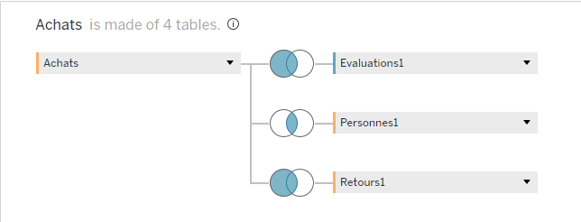

# Sales Performance & Customer Satisfaction Analysis

## 1. Project Overview
* **Goal:** This project delivers a comprehensive analysis of commercial data to monitor sales performance, identify trends, and correlate customer satisfaction with revenue.
* **Context:** Using the `achats.xls` and `evaluations_clients.xlsx` datasets, we built a scalable data model to support strategic decision-making.
* **Tools:** Tableau Desktop / Public.

## 2. Data Architecture & Preparation
*Effective analysis starts with a robust data model. This project utilizes a hybrid model combining Physical Joins and Logical Relationships to ensure accurate aggregation.*

### 2.1 Data Source Model
**Logical Layer (The "Noodle"):**

* **Achats ↔ Evaluations:** We established a **Logical Relationship** between the Sales data (`Achats`) and Customer Feedback (`Evaluations`).
    * **Why?** Unlike a physical join, a relationship preserves the native Level of Detail (LOD) for both tables. This is crucial for calculating the **Average Satisfaction Score** correctly without row duplication inflating the results.


**Physical Layer (The Joins):**

Inside the `Achats` logical table, we utilized specific joins to consolidate transactional data:
* **Left Join (Achats ↔ Retours):** Ensures we retain *all* sales transactions in the view, bringing in return data only where it exists.
* **Inner Join (Achats ↔ Personnes):** Links sales transactions to specific regional managers.



### 2.2 Hierarchies & Grouping
To enable "Drill-down" analysis—allowing users to move from high-level summaries to granular details—we created two key hierarchies:

**1. Product Hierarchy:**
Allows navigation from broad Categories down to individual Product Names.
* `Catégorie` $\rightarrow$ `Sous-catégorie` $\rightarrow$ `Nom du produit`


**2. Geography Hierarchy:**
Facilitates mapping and location-based analysis.
* `Pays` $\rightarrow$ `Région` $\rightarrow$ `Ville`


## 3. Key Technical Calculations
*To support advanced analysis and business rules, several custom calculated fields were implemented.*

### 3.1 Financial Logic (Eco-Tax)
**Goal:** Apply a 5% Eco-Tax specifically to Technology products, while incentivizing sustainability by exempting items marked as "Recycled."
* **Script:**
```sql
IF [Catégorie] = "Produits technologiques" 
AND NOT CONTAINS([Nom du produit], "recyclé") 
THEN [Montant des ventes] * 0.05 
END
```

### 3.2 Strategic Indicators

**Profit Ratio:**
*Standardizes profitability analysis by calculating the margin percentage relative to revenue.*

* **Script:** `SUM([Profit]) / SUM([Montant des ventes])`

**Profit Target Attainment:**
*A dynamic KPI tracking if the profit meets the initial target threshold (scaled by factor 200 for this context).*

* **Determination Script:** `(SUM([Profit]) / 200)`
* **Indicator Script:**

```sql
IF (SUM([Profit]) / 200) >= 1 THEN
    "Profit initial atteint"
ELSE
    "Profit initial non atteint"
END
```
### 3.3 Conditional Alerts & Benchmarking :

**Low Sales Flag (< 1000):**
*Used for conditional formatting to instantly highlight underperforming transactions (Where "Faux" indicates sales < 1000).*

* **Script:**

```sql
IF SUM([Montant des ventes]) >= 1000 
THEN "Vrai" 
ELSE "Faux" 
END
```
**Dynamic Average Benchmark:**
*Compares specific sales against the Window Average to spot outliers.*

* **Script:**

```sql
IF SUM([Montant des ventes]) >= WINDOW_AVG(SUM([Montant des ventes])) THEN
    "Above Average"
ELSE
    "Below Average"
END
```


